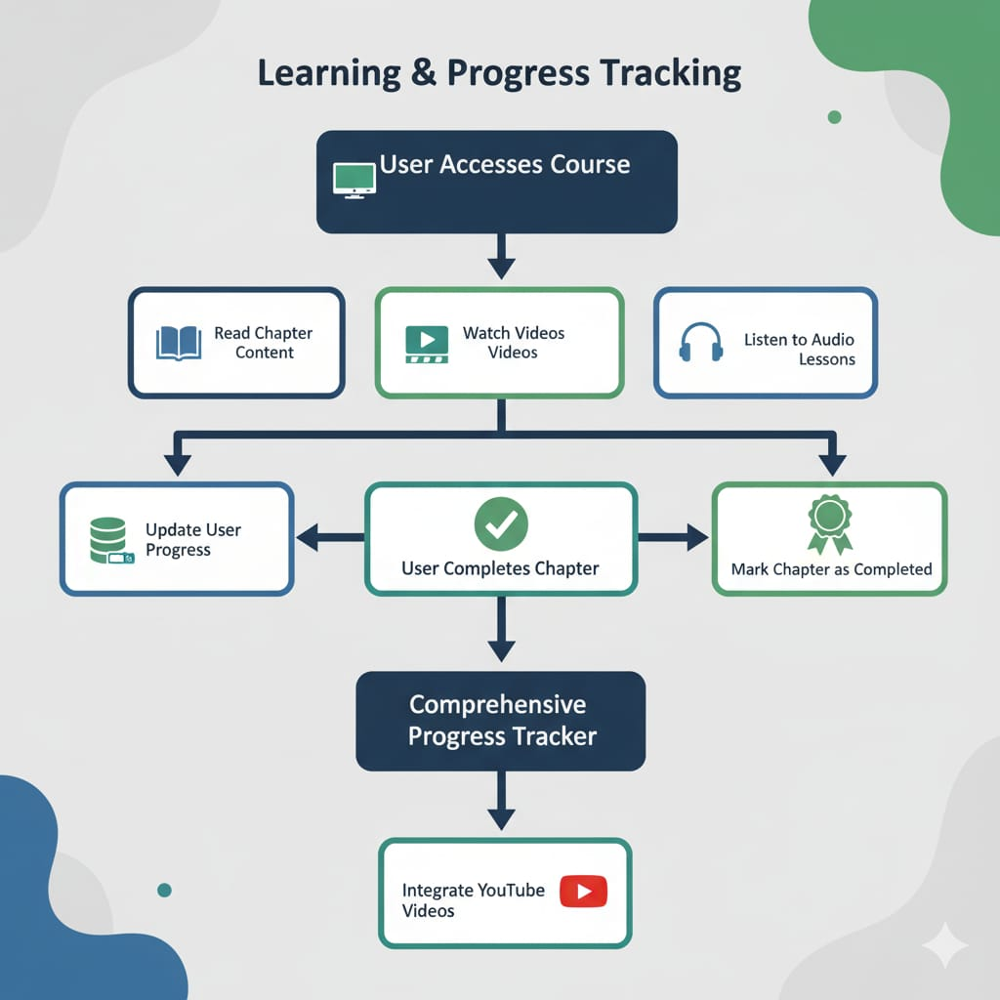
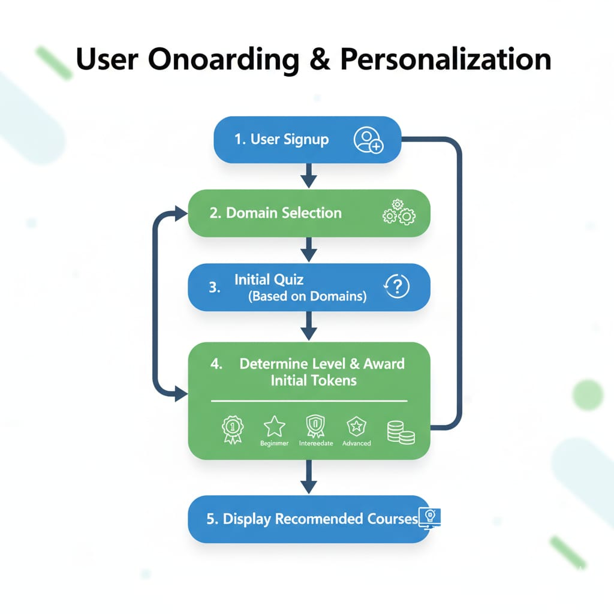

# EDUYUG — Backend API
 

Backend API for the Smart Education hackathon challenge.

One-liner:  
"An AI-powered learning platform that assesses a student's level, provides personalized courses, and uses a token-based economy to incentivize learning."

---

📚 Table of Contents
- [🌊 Application Workflow](#-application-workflow)
  - [Flowchart — User Journey](#flowchart---user-journey)
  - [Flowchart — Course Creation & Background Job](#flowchart---course-creation--background-job)
- [🚀 Setup and Run Instructions](#-setup-and-run-instructions)
  - [Prerequisites](#prerequisites)
  - [Installation](#installation)
  - [Environment Variables](#environment-variables)
  - [Running the Server](#running-the-server)
- [🛠️ Tech Stack and Libraries](#️-tech-stack-and-libraries)
- [✨ Key Features](#️-key-features)
- [⚠️ Known Limitations](#️-known-limitations)
- [🤖 AI & Pre-existing Code Disclosure](#️-ai--pre-existing-code-disclosure)
- [🗂️ Backend Structure & Important Files](#️-backend-structure--important-files)
- [📸 Visuals / Diagrams](#️-visuals--diagrams)
- [🔧 Operational Notes & Recommendations](#-operational-notes--recommendations)

---


## 🚀 Setup and Run Instructions

### Prerequisites
- Node.js 18+ (or LTS matched to project)
- npm (or yarn)
- MongoDB (local or cloud)
- (Optional) Redis for job queue
- Git

### Installation

Open a terminal (Windows cmd / PowerShell):

```cmd
cd "d:\All Programs and Projects\Smart Education\backend"
git clone <your-repo-url> .
npm install
```

### Environment Variables

Copy the example env and populate keys:

```cmd
copy .env.example .env
```

Key variables (add to `.env`):

- MONGO_URI or DATABASE_URL = mongodb connection string
- JWT_SECRET = secret for JWT tokens
- PORT = 4000 (or your port)
- OPENAI_API_KEY (or other LLM key) = AI provider key
- YOUTUBE_API_KEY = (for Youtube metadata)
- NODE_ENV = development

> Note: some config files are under `src/config/` (AI-Config.js, YoutubeConfig.js).

### Running the Server

Development:

```cmd
npm run dev
```

Production:

```cmd
npm run start
```

Seeder (populate initial courses & quizzes):

```cmd
npm run seed
```

(Seeder reads `src/config/datanew.json` and `quizzes.json`)

---

## 🛠️ Tech Stack and Libraries

| Category         | Technology / Libraries |
|------------------|------------------------|
| Runtime          | Node.js (v18+) |
| Framework        | Express.js |
| Database         | MongoDB (Mongoose) |
| Authentication   | JWT, bcrypt |
| AI / LLM         | Gemini API helper (AI-Config.js) |
| Media API        | YouTube Data API (YoutubeConfig.js) |
| Utils / Others   | axios, dotenv, nodemon, (logging) |

---

## ✨ Key Features

- Smart Onboarding: Initial domain-based quiz to assess level.
- Token Economy: Create (10 tokens) / Enroll (5 tokens) & earn tokens via quizzes.
- AI Course Generation: Background generation of chapters, quizzes, flashcards, and Q&A.
- Personalized Recommendations: Courses suggested by domain + user level.
- Multi-Modal Learning: Text chapters, embedded YouTube videos, audio lessons.
- Progress Tracking & Gamification: Chapter completion, course progress, badges.
- Integrated AI Chatbot: On-demand help for learners.

---

## ⚠️ Known Limitations

- AI generation is synchronous in code by default and can be slow — moving to a job queue is recommended.
- Limited retry / failure handling for long-running AI tasks (use persistent job queue & retries).
- No comprehensive test suite included (time constraints for hackathon).
- Some routes have minimal validation; sanitization may be required for untrusted LLM output.
- Large media (video audio) is represented by metadata only — no heavy media hosting implemented.

---

## 🤖 AI & Pre-existing Code Disclosure

- AI-Generated Code: Parts of boilerplate and helper functions were scaffolded with AI assistants (GitHub Copilot) and manual edits. This README’s flowcharts were composed manually and adapted from project logic.
- Pre-existing Code: The project uses an existing Express + Mongoose boilerplate (personal starter) and seeder JSON files (`src/config/*.json`) to accelerate development.
- Responsible AI Use: LLM outputs are sanitized where possible (see `src/config/getCourseLevel.js` and sanitizers). Do not expose raw LLM output to users without review in production.

---

## 🗂️ Backend Structure & Important Files

Top-level backend files/folders:

```
backend/
  ├─ src/
  │   ├─ config/
  │   │   ├─ AI-Config.js
  │   │   ├─ courseSeed.js
  │   │   ├─ datanew.json
  │   │   ├─ db.js
  │   │   ├─ env.js
  │   │   ├─ getCourseLevel.js
  │   │   ├─ quizSeed.js
  │   │   └─ YoutubeConfig.js
  │   ├─ controllers/
  │   │   ├─ auth.controller.js
  │   │   └─ course.controller.js
  │   ├─ middleware/
  │   │   └─ auth.middleware.js
  │   ├─ models/
  │   │   ├─ auth.model.js
  │   │   ├─ course.model.js
  │   │   └─ quiz.model.js
  │   └─ routes/
  │       ├─ auth.routes.js
  │       └─ course.routes.js
  ├─ package.json
  └─ README.md
```

Important endpoints (quick reference)
- POST /api/auth/signup — sign up & domain selection, returns initial quiz
- POST /api/auth/submit-initial-quiz — submit initial quiz, award tokens and assign level
- POST /api/courses — create course (deduct tokens, enqueue generation)
- GET /api/courses/:id — get course by id (polling for status)
- POST /api/courses/:id/enroll — enroll user (deduct tokens)
- GET /api/quizzes/:courseId — fetch quizzes
- POST /api/quizzes/:quizId/submit — submit quiz (earn tokens)

(See `src/routes/` for full route definitions.)

---

## 📸 Visuals / Diagrams

Use the two provided images to visually explain onboarding and progress — place them here so GitHub can render them in the README.

Place the images in `backend/docs/` and name them:

- `backend/docs/onboarding_flow.png` (user onboarding & personalization)
- `backend/docs/progress_flow.png` (learning & progress tracking)

Embed in README:




> NOTE: I included two diagram **Mermaid** charts above for direct rendering on GitHub. If you prefer static images, add the two PNGs into `backend/docs/` using the filenames above.

---

## 🔧 Operational Notes & Recommendations

- Use a robust job queue (Bull/BullMQ + Redis) for AI course generation. This prevents timeouts and allows retries.
- Add monitoring/observability (Sentry / Datadog / Prometheus) for long-running tasks.
- Implement content moderation for LLM outputs.
- Scale AI calls: batch requests and cache repeated prompts.
- Consider rate-limiting endpoints that invoke AI.

---

If you want, I can:
- A) Commit the two PNGs into `backend/docs/` and update the README to reference them (upload the images here or confirm names).
- B) Export the Mermaid diagrams to SVG and place them into `backend/docs/` for guaranteed rendering.
- C) Scaffold a BullMQ worker and sample `generateCourse` job (producer + consumer) and add it to `src/workers/`.


---

## Application workflow (summary)

High-level user flow implemented by the backend:
signup → initial quiz → level & tokens → recommended courses → create/enroll → AI generation (Gemini) → study → progress → badges. An AI chatbot runs in parallel.

Important clarifications (these resolve the issues you reported)
- Course generation uses Google Gemini API (GEMINI_API_KEY). The project did NOT use generic "LLM models" wording — README is updated to reflect Gemini specifically.
- The current project does NOT use Redis/Bull by default. AI generation runs as a background job/worker in-process (suitable for development / hackathon). For production we recommend moving to a persistent queue (Bull/BullMQ + Redis).
- The Mermaid flowcharts in the previous README are often not rendered on GitHub unless repository settings or extensions are enabled. This README replaces inline Mermaid with plain-text flows and provides export instructions so diagrams render consistently.

User journey (text flow)
1. User signup → select domains  
2. Serve initial quiz (domain-based) → evaluate → assign level & award initial tokens  
3. Dashboard: recommend courses by domain+level  
4. Create course (costs tokens) → placeholder course (status=processing) → background generate content (Gemini) → update course to ready  
5. Enroll (costs tokens) → study → complete chapters → update progress & award badges/tokens

Course creation background job (text flow)
1. Frontend POST /api/courses  
2. API verifies tokens, deducts cost, inserts placeholder course (status=processing)  
3. Background worker (in-process) calls Gemini API and optional YouTube metadata service → generate chapters, quizzes, flashcards, Q&A, video metadata  
4. Worker validates & updates course document → status=ready

---

## 📱 Mobile app (Client) — reference & data contract

This repo includes a React Native / Expo mobile client under the `app/` folder. Below are quick run instructions, how the client connects to the backend, and the minimal request/response shapes the mobile app expects.

Run (from repository root, Windows PowerShell / cmd):
```cmd
cd "d:\All Programs and Projects\Smart Education\Smart-Educator"
npm install
npx expo start
# then press 'a' for Android emulator, 'i' for iOS simulator, or open in Expo Go
```


Environment/config for mobile
- The app uses a base API URL constant. Set the backend URL in `assets/constants` or an env file used by the client (example name: REACT_NATIVE_API_URL / API_URL).
- Example constant (place in `assets/constants/index.ts` if missing):

```ts
// filepath: app/assets/constants/index.ts
export const API_BASE = process.env.API_URL ?? "http://localhost:4000/api";
export const YOUTUBE_API_KEY = process.env.YOUTUBE_API_KEY ?? "";
```

Important client-to-backend endpoints (minimal contract)

1) Signup (domain selection)
- Endpoint: POST /api/auth/signup
- Request:
```json
{
  "name": "Jane Doe",
  "email": "jane@example.com",
  "password": "supersecret",
  "domains": ["math","programming"]
}
```
- Response (success):
```json
{
  "user": { "_id":"...", "name":"Jane Doe", "domains":["math"], "tokens": 10, "level": "Beginner" },
  "token": "<jwt>"
}
```

2) Submit initial quiz
- Endpoint: POST /api/auth/submit-initial-quiz
- Request:
```json
{
  "userId": "...",
  "quizAnswers": [{ "questionId":"q1","answer":"b" }, ...]
}
```
- Response:
```json
{
  "level": "Intermediate",
  "tokensAwarded": 5,
  "totalTokens": 15
}
```

3) Create course (client posts a create request; backend returns a placeholder)
- Endpoint: POST /api/courses
- Auth: Bearer JWT
- Request body (example):
```json
{
  "title": "Intro to Algebra",
  "domain": "math",
  "level": "Beginner",
  "notes": "Focus on fundamentals",
  "language": "en"
}
```
- Response (placeholder course)
```json
{
  "_id": "course_123",
  "title": "Intro to Algebra",
  "domain": "math",
  "level": "Beginner",
  "status": "processing",
  "creator": "user_456",
  "cost": 10,
  "createdAt": "2025-11-06T..."
}
```
- Background update: when generation completes the server updates the course doc: status -> "ready" and writes chapters, quizzes, flashcards, and optional video metadata.

4) Polling course by id (client expects stable fields)
- Endpoint: GET /api/courses/:id
- Response (when ready):
```json
{
  "_id":"course_123",
  "title":"Intro to Algebra",
  "status":"ready",
  "chapters":[
    { "id":"c1","title":"Numbers","content":"...", "video": { "id":"yt_xxx","title":"..." } }
  ],
  "quizzes":[...],
  "flashcards":[...]
}
```

5) Enroll in course
- Endpoint: POST /api/courses/:id/enroll
- Auth required. Cost enforced server-side (default: 5 tokens).

Client-side expectations / notes
- Token balances must be displayed and updated after operations (create/enroll/quiz reward).
- Course creation may be asynchronous — UI should show placeholder state, poll GET /api/courses/:id or use push/WS if added later.
- Sanitize/escape any returned HTML/text from Gemini output before rendering.
- Large media are referenced via metadata (YouTube id/url) — client embeds via WebView or native YouTube player.

Server-side clarifications relevant to the client
- Course generation uses Google Gemini API (GEMINI_API_KEY) and currently runs in-process (no Redis by default). Expect variable latency on creation.
- If you add a Redis/Bull queue later, the API contract remains the same; only generation becomes externalized.

Where to update the client if backend URL changes
- Replace API_BASE in `app/assets/constants/index.ts` or set REACT_NATIVE_API_URL in your environment used by Expo.

---

If you want, I can:
- A) Add the sample constants file into `app/assets/constants/index.ts` and commit it.
- B) Add minimal example screens that show placeholder -> ready flow and polling logic.
- C) Generate Postman / HTTP collection with the request/response examples above.

Reply with A, B, or C to proceed.